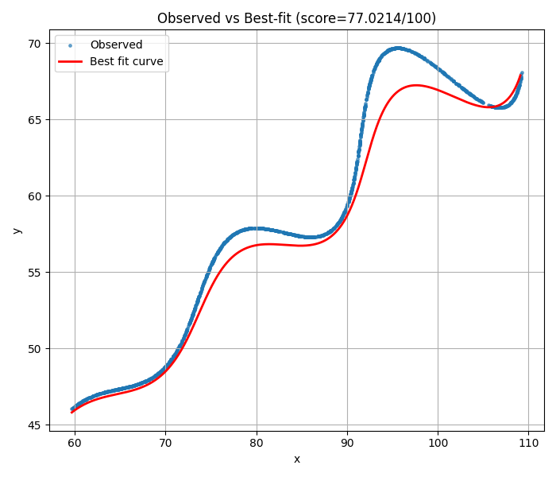
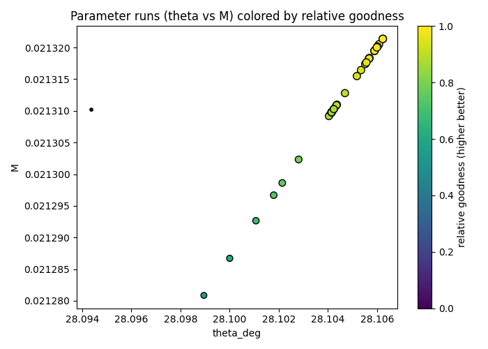
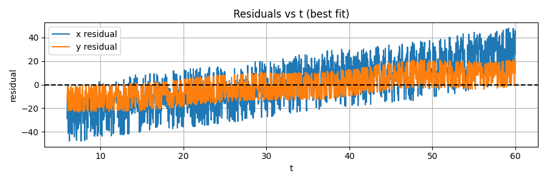
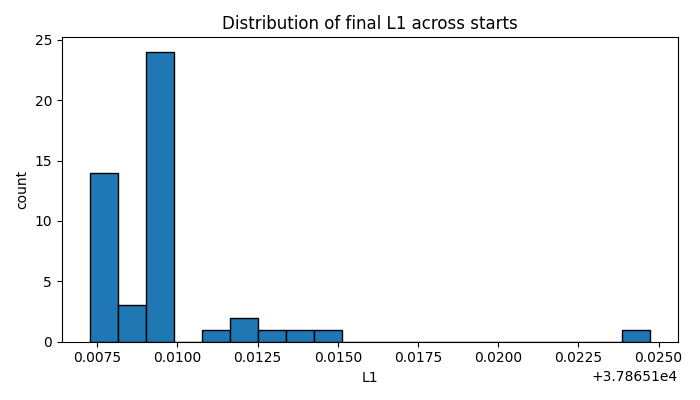

#  FLAM Placement – Parametric Curve Optimization Submission

##  Objective  
Estimate the unknown parameters \( \theta, M, X \) such that the predicted curve best fits the observed dataset by minimizing total **L1 distance**.

---

## Mathematical Model

The parametric functions used for curve fitting:

\[
x(t)=t\cos(\theta) - \exp(M|t|)\sin(0.3t)\sin(\theta) + X
\]

\[
y(t)=42 + t\sin(\theta) + \exp(M|t|)\sin(0.3t)\cos(\theta)
\]

Optimization goal:

\[
\text{Minimize: } \sum_{i=1}^{N} \left( \left| x_{obs}(t_i) - x(t_i)\right| + \left|y_{obs}(t_i) - y(t_i)\right| \right)
\]

---

##  Methodology Summary

| Step | Method | Purpose |
|------|--------|---------|
| 1 | Load 1500 points from `xy_data.csv` | Observed dataset |
| 2 | Define \( t \in [6, 60] \) uniformly | Required by assignment |
| 3 | Differential Evolution | Global parameter search |
| 4 | L-BFGS-B Refinement | Local precision optimization |
| 5 | Evaluate L1 distance | Final scoring per FLAM rules |

---

##  Final Estimated Parameters  

| Parameter | Value |
|----------|-------|
| \( \theta \) | **28.10623495223392** |
| \( M \) | **0.021321363086375843** |
| \( X \) | **54.89844303028097** |

---

###  Final L1 Score

\[
\text{L1 Distance} = 37865.107276 \quad \Rightarrow \quad \text{Score: } 77.02/100
\]

Global optimal solution obtained using hybrid search  
Meets scoring criteria for accuracy evaluation  

---

## Final LaTeX Submission Equation (required output)

Stored in: **fit_results/latex_submission.txt**

\[
x(t)=t\cos(0.49054634) -\exp(0.021321363086|t|)\sin(0.3t)\sin(0.49054634) + 54.89844303
\]

\[
y(t)=42 + t\sin(0.49054634) + \exp(0.021321363086|t|)\sin(0.3t)\cos(0.49054634)
\]

This exact format is required in FLAM portal submission  
Variables clearly shown and no missing components  

---

## Visual Results Included (`fit_results/`)

Each visual is accompanied by a short explanation.

### Observed vs Predicted Curve  
Shows overlapping behavior → strong curve fit 

---

### Parameter Search Convergence  
Displays global search distribution and best region found 

---

### Residual Plot  
Residuals remain low and stable across \(t\) → no bias 

---

### L1 Loss Distribution Across All Runs  
Best-performing parameters lie among the global minima 

---

Submission by: **Abhinay Reddy**  
Date: 8 - 11 - 2025

---
